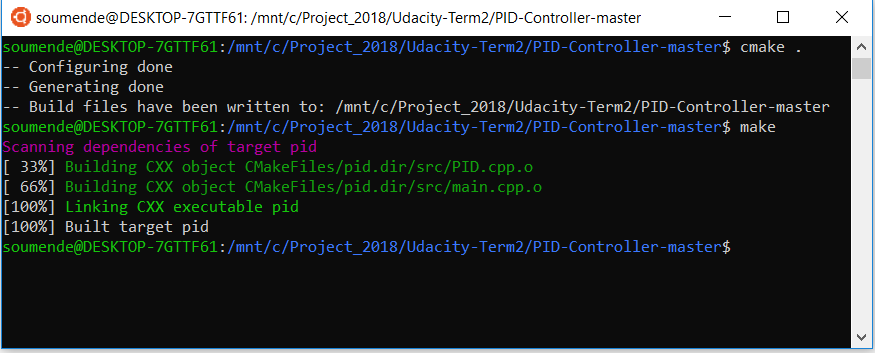

# Driving a Vehicle with PID Control
Udacity SDCND Term 2, Project 4

## Project Basics
In this project a Proportional-Integral-Derivative Controller, (PID), is used  to drive a simulated car around a virtual track. The project involves implementing the controller primarily for the steering angle of the car and this value from this controller is also used to determine throttle angle. The PID parameter values were also tuned using Twiddle and mnanual fine tuning approach to calculate a steering angle that keeps the car on the track.

#### Project Steps
* Implement PID Controller for Steering (optional: controlling throttle as well)
* Optimize init parameters for each PID coefficient

## Project Dependencies

* cmake >= 3.5
  * All OSes: [click here for installation instructions](https://cmake.org/install/)
* make >= 4.1
  * Linux: make is installed by default on most Linux distros
  * Mac: [install Xcode command line tools to get make](https://developer.apple.com/xcode/features/)
  * Windows: [Click here for installation instructions](http://gnuwin32.sourceforge.net/packages/make.htm)
* gcc/g++ >= 5.4
  * Linux: gcc / g++ is installed by default on most Linux distros
  * Mac: same deal as make - [install Xcode command line tools]((https://developer.apple.com/xcode/features/)
  * Windows: recommend using [MinGW](http://www.mingw.org/)
* [uWebSockets](https://github.com/uWebSockets/uWebSockets) == 0.13, but the master branch will probably work just fine
  * Follow the instructions in the [uWebSockets README](https://github.com/uWebSockets/uWebSockets/blob/master/README.md) to get setup for your platform. You can download the zip of the appropriate version from the [releases page](https://github.com/uWebSockets/uWebSockets/releases). Here's a link to the [v0.13 zip](https://github.com/uWebSockets/uWebSockets/archive/v0.13.0.zip).
  * If you run OSX and have homebrew installed you can just run the ./install-mac.sh script to install this
* Simulator. You can download these from the [project intro page](https://github.com/udacity/CarND-PID-Control-Project/releases) in the classroom.

## Basic Build Instructions 
## Rubric - Compilation (Your code should compile)
### the following steps were followed to compile and run the code

1. Clone this repo.
2. Make a build directory: `mkdir build && cd build`
3. Compile: `cmake .. && make`

4. Run it: `./pid`. 

## Rubric - Implementation (The PID procedure follows what was taught in the lessons.)
#### Finding the right coefficients

Initiall the Twiddle algorithm was used for trying out different parameters, then fine tuned with some manual tuning. I had also used an approach with SGD (stochastic gradient descent) before, but that did not seem to perform as well as Twiddle. Multiple runs were made and bit of trial and error approach was used to get the desired parameters

In the end, the final values were determined as (0.2, 0.004, 3.0) that seemed to work well. Increasing or decreasing them caused the  car to veer off during curves, 

## Rubric- Reflection  (Describe the effect each of the P, I, D components had in your implementation.)

#### Components of PID
The actual implementation of code for a basic PID controller is fairly straightforward, but making the controller actually perform well is the tough part. Having knowledge of each part of "PID" is important:
* The "P" for proportional means that the car will steer in proportion to the cross-track error, or CTE. CTE is essentially how far from the middle line of the road the car is. This makes sense, as if the car is to the left of the line then you would want to steer to the right; if it is far to the left of the middle with a high CTE then you want a higher steering angle. However, if the coefficient is set too high for P, the car will oscillate a ton, as the car will constantly overcorrect and overshoot the middle. If the coefficient is too low, the car may react too slowly to curves when the car gets off-center with a higher CTE.
* The "I" for integral sums up all CTEs up to that point, such that too many negative CTEs (in this case, meaning the car has been to the left of the middle of the lane for awhile) will drive up this value, causing the car to turn back toward the middle, preventing the car from driving on one side of the lane the whole time. If the coefficient is too high for I, the car tends to have quicker oscillations, and does not tend to get up to a quick speed. A low coefficent for I will cause the car to tend to drift to one side of the lane or the other for longer periods of time.
* The "D" for derivate is the change in CTE from one value to the next. This means that 1) if the derivative is quickly changing, the car will correct itself (i.e. higher steering angle) faster, such as in the case of a curve, and 2) if the car is moving outward from the middle, this will cause the steering to get larger (as the derivative sign will match the proportional sign), but if the car is moving toward the center (meaning the derivative value will be negative), the car's steering angle will get smoothed out, leading to a more smoother driving experience. Too high of a coefficient leads to almost constant steering angle changes of large degrees, where although the car will be well-centered it can hardly move. Too low of a D coefficient will lead to the oscillations being too high with more overshooting.

These behaved fairly in line with what I was expecting.

## Rubric- Reflection (Describe how the final hyperparameters were chosen)

The final parameters were chosen based on a combination of playing with the twiddle algorithm, then followed my manual fine tuning using a trial and error approach. Refer to the previous section for further explanation.

## Rubric - Criteria (The vehicle must successfully drive a lap around the track.)
A video of the simulated car driving around the track can be found [here.](https://github.com/mvirgo/PID-Control-Project/blob/master/PID_control_vid.mov)

